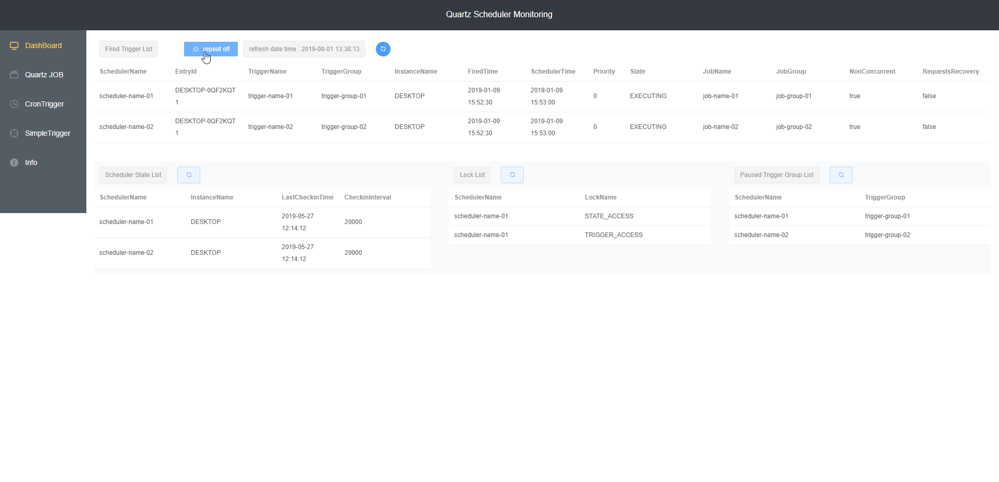
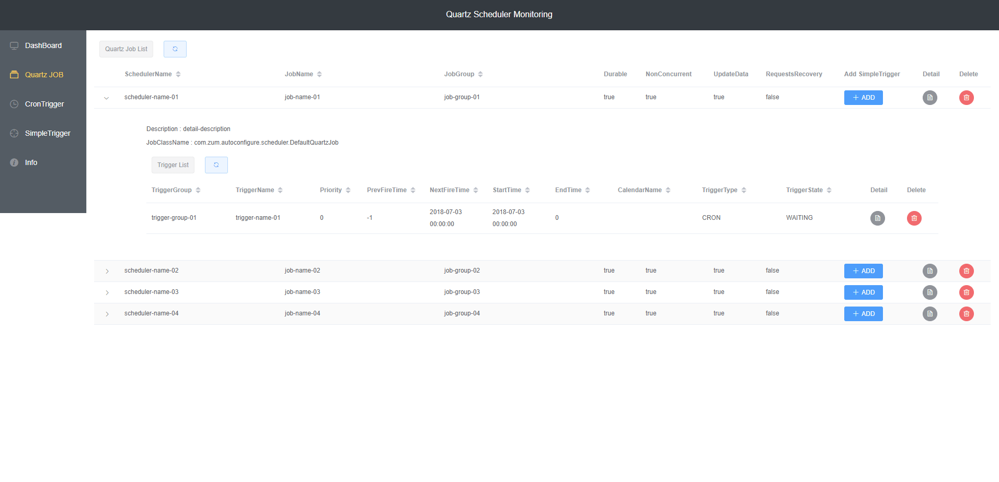

# quartz-vue-admin

- It is an application that monitors the scheduler developed by Quartz Scheduler Library
- It is available by registering SimpleTrigger to QuartzJob.

## Prerequisites
- npm >=5.6.0
- node >= 8.11.3
- jdk 1.8
## Project setup

- frontend root : src/main/frontend
```
npm install
```

#### Compiles and hot-reloads for development
```
npm run serve
```

#### Compiles and minifies for production
```
npm run build
```

#### Run your tests
```
npm run test
```

#### Lints and fixes files
```
npm run lint
```

#### Java Spring Boot Application run

- profile local
  - h2 database (sample data)
- profile prod
  - enter your database info

## preview




